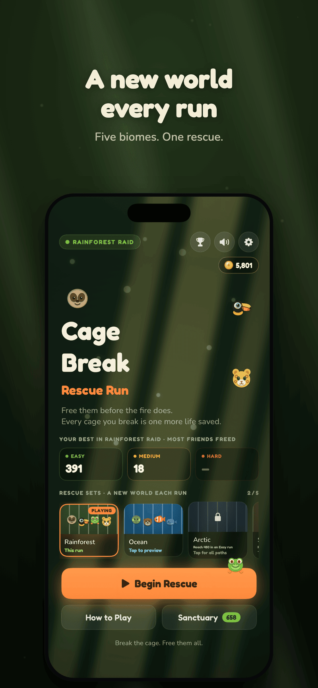
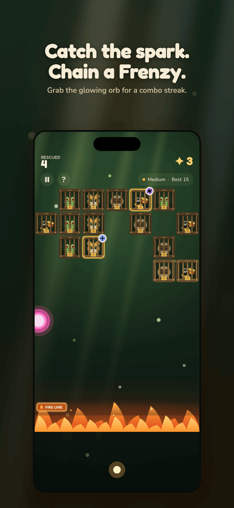
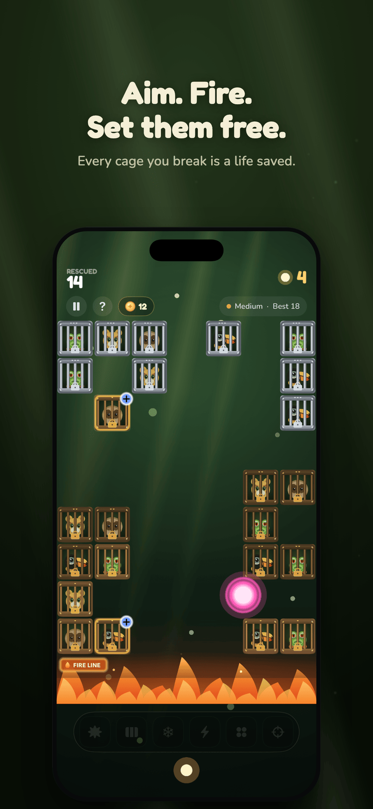
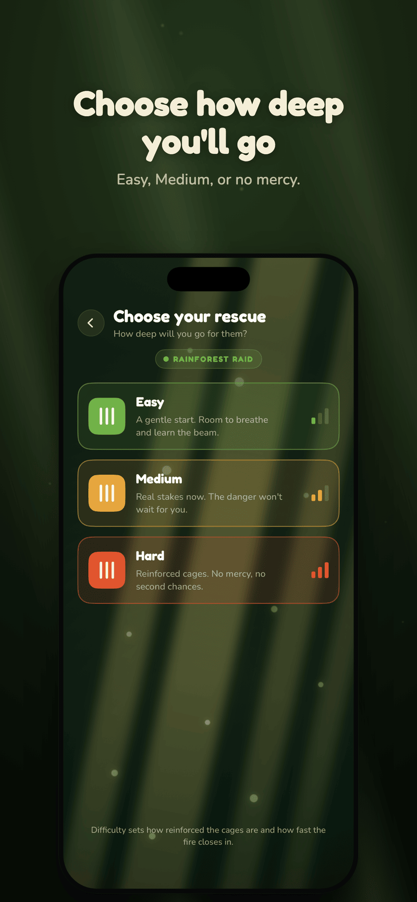
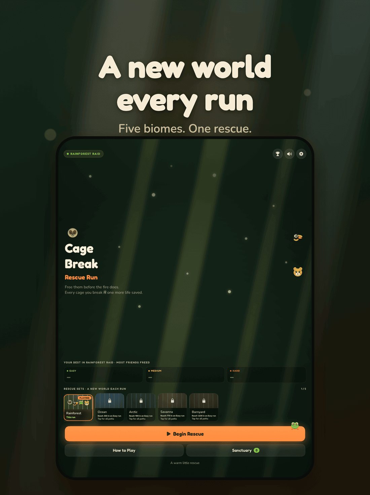

  

# Cage Break: Rescue Run

A cozy iOS brick-breaker with an animal-rescue heart. Aim, fire a salvo of balls, and free the caged animals before they cross the danger line. Five hand-themed rescue worlds, three difficulties, and optional Game Center leaderboards — no account required.

## Screenshots

### iPhone

  
  
  
  

### iPad

  

## How to Play

- **Drag to aim** an upward shot, then release to fire a stream of balls.
- Balls fan out, bounce off walls and cages, chip away at each cage's HP, and return to the floor.
- After every salvo the whole field **descends one row** and a fresh row spawns at the top.
- The run ends when a cage crosses the **danger line**. Your score is how many animals you free before then — multiplied by your **Frenzy** combo.

## Rescue Worlds

Five hand-themed worlds, each with its own cast of animals, music, danger, and app icon. Freed animals collect in your persistent **Sanctuary**.

- 🌴 **Rainforest** — where every rescue begins
- 🌊 **Ocean**
- ❄️ **Arctic**
- 🦁 **Savanna**
- 🐄 **Barnyard**

## Features

- Three difficulties — **Easy / Medium / Hard** — that trade ball count, cage HP, spawn density, and runway to the danger line
- **Power-ups** ride down in their own cages — *A Friend Returns* (an extra ball), a bomb, a laser, and a shield
- A catchable **Frenzy** orb that stacks a ×2–×5 score-multiplier combo
- Per-difficulty **high scores** saved on device
- A persistent **Sanctuary** of every animal you've freed
- **Optional Game Center leaderboards** — one board per world × difficulty
- Alternate **app icons**, one per rescue world
- Portrait-only, universal (iPhone + iPad)
- Fully playable offline — no account, no sign-up
- Full dark mode

## Premium

Cage Break is free to play. All five rescue worlds unlock naturally as you reach score milestones. A one-time in-app purchase unlocks **every rescue world instantly**, so you can jump straight to your favorite biome.

## Requirements

- iOS 17.0+
- iPhone and iPad

## Privacy

Cage Break does not collect or share any of your personal data. There are no ads and no analytics. Optional Game Center leaderboards are handled by Apple. See our full [Privacy Policy](PRIVACY.md).

## Support

Have a question or found a bug? Check our [Support & FAQ](SUPPORT.md) page or [open an issue](https://github.com/idevtim/cage-break/issues).

## License

All rights reserved.
