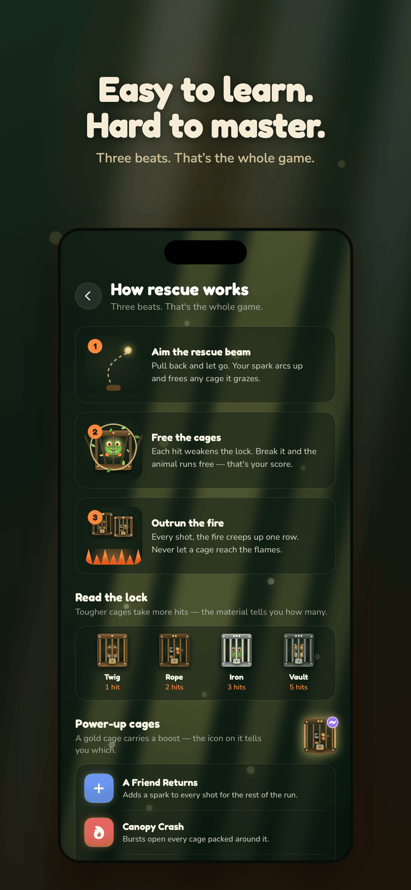
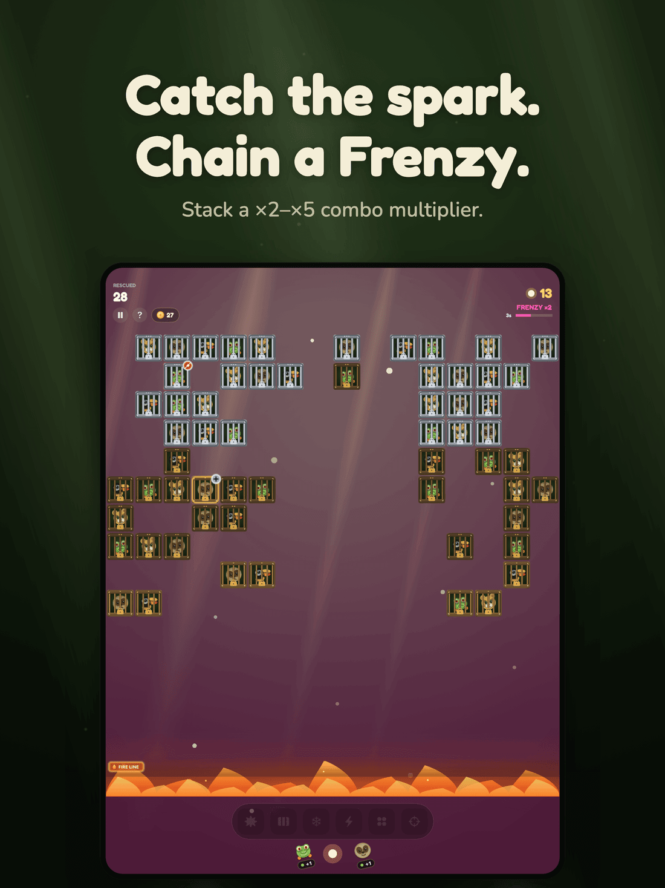
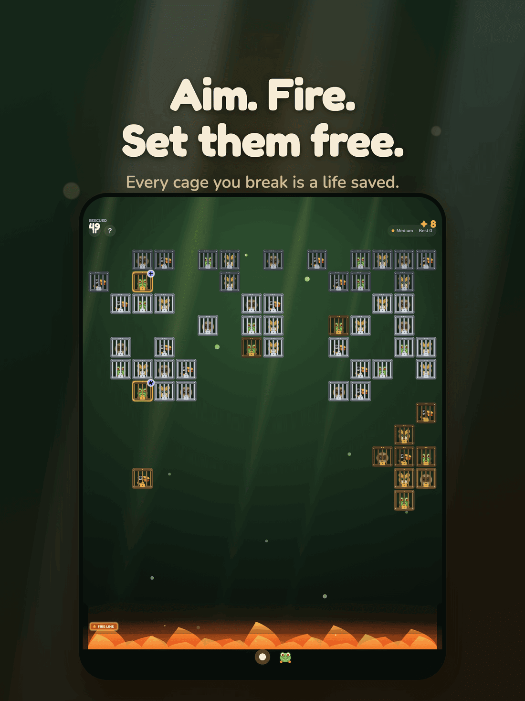
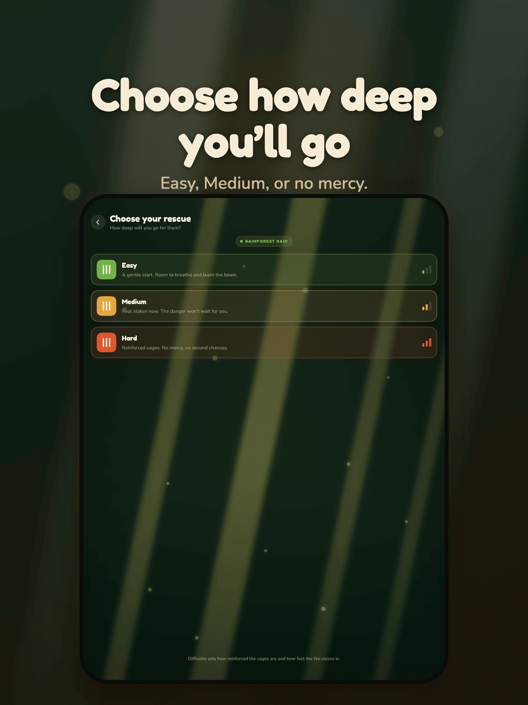
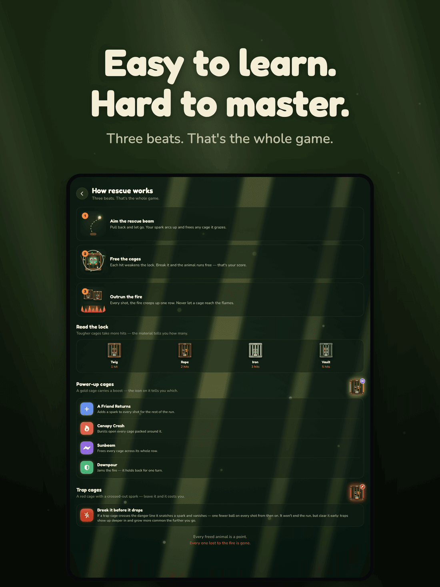

  

# Cage Break: Rescue Run

  <a href="https://apps.apple.com/us/app/cage-break-rescue-run/id6786849290"><strong>Download on the App Store →</strong></a>

A cozy iOS brick-breaker with an animal-rescue heart. Aim, fire a salvo of balls, and free the caged animals before they cross the danger line. Five hand-themed rescue worlds, three difficulties, and optional Game Center leaderboards — no account required.

## Screenshots

### iPhone

  
  
  
  
  

### iPad

  
  
  
  
  

## How to Play

- **Drag to aim** an upward shot, then release to fire a stream of balls.
- Balls fan out, bounce off walls and cages, chip away at each cage's HP, and return to the floor.
- After every salvo the whole field **descends one row** and a fresh row spawns at the top.
- Watch for **trap cages** — let one reach the danger line and it steals a ball from your salvo.
- The run ends when a cage crosses the **danger line**. Your score is how many animals you free before then — multiplied by your **Frenzy** combo.

## Rescue Worlds

Five hand-themed worlds, each with its own cast of four animals, ambient music, danger line, and icons — 20 species in all. Freed animals collect in your persistent **Sanctuary**, and return mid-run as a helper squad.

- 🌴 **Rainforest Raid** — where every rescue begins
- 🌊 **Ocean Haul** — danger comes as a net
- ❄️ **Arctic Breakout** — mind the crevasse
- 🦁 **Savanna Run** — outrun the dust storm
- 🐄 **Barnyard Liberation** — beat the truck

Worlds unlock in order: clear a score milestone in one world to open the next (Pro unlocks all five instantly).

## Features

- Three difficulties — **Easy / Medium / Hard** — that trade starting ball count (4/2/1), how fast cage HP scales, spawn density, and power-up frequency
- **Power-ups** ride down in their own cages — an extra ball (*A Friend Returns*), a bomb, a laser, and a shield, each renamed to fit its world
- A catchable **Frenzy** orb that stacks a ×2–×5 score multiplier, doubles ball damage, and switches you to rapid fire
- **High scores** saved on device for every world × difficulty
- A persistent **Sanctuary** of every animal you've freed
- **Coins** earned every run, spent in the **Shop** on equippable loadout modifiers, single-use consumables, and ball & shooter kits
- **Optional Game Center leaderboards** — 15 boards, one per world × difficulty
- **25 app icons** — five world heroes plus a portrait of every rescuer (Pro)
- Runs pick up where you left off — close the app mid-run and resume later
- Independent **music, sound effects, and haptics** toggles
- Universal (iPhone + iPad); portrait on iPhone, any orientation on iPad
- Fully playable offline — no account, no sign-up, no ads, no analytics
- Dark by design, end to end

## Cage Break Pro

Cage Break is free to play, and all five rescue worlds unlock naturally as you reach score milestones. **Cage Break Pro** is an optional one-time **$2.99** in-app purchase that:

- **Unlocks every rescue world instantly** — jump straight to your favorite biome, no grinding
- **Enables the app-icon changer** — pick any of the 25 icons for your Home Screen
- **Unlocks every ball & shooter kit** in the Shop

Buy once, unlock forever, on all your devices — with **Restore Purchases** if you reinstall or switch devices.

Coins are earned by playing, and optional coin packs are also available as in-app purchases if you'd rather skip the grind.

## Requirements

- iOS 17.0+
- iPhone and iPad

## Privacy

Cage Break does not collect or share any of your personal data. There are no ads and no analytics. Optional Game Center leaderboards are handled by Apple. See our full [Privacy Policy](PRIVACY.md).

## Support

Have a question or found a bug? Check our [Support & FAQ](SUPPORT.md) page or [open an issue](https://github.com/idevtim/cage-break/issues).

## Download

[Cage Break: Rescue Run on the App Store](https://apps.apple.com/us/app/cage-break-rescue-run/id6786849290)

## License

All rights reserved.
